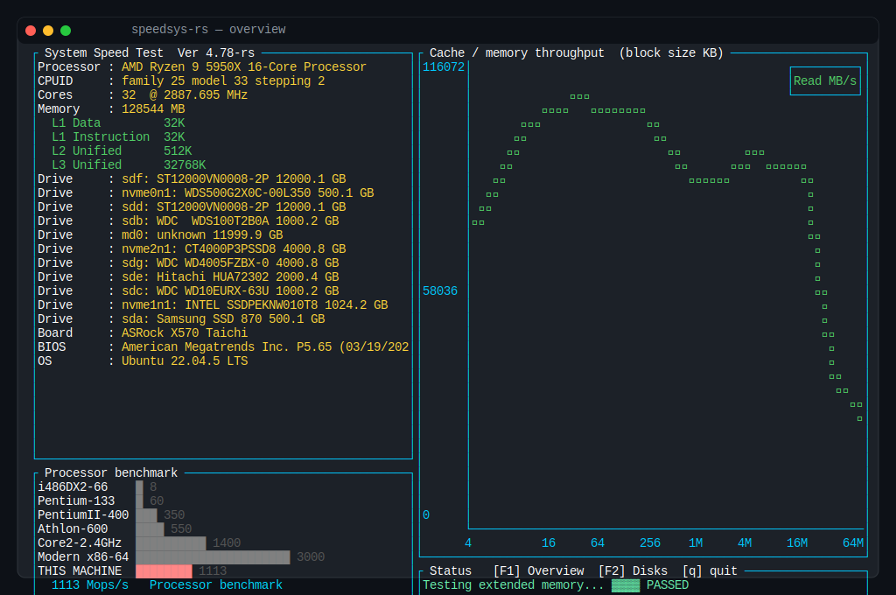
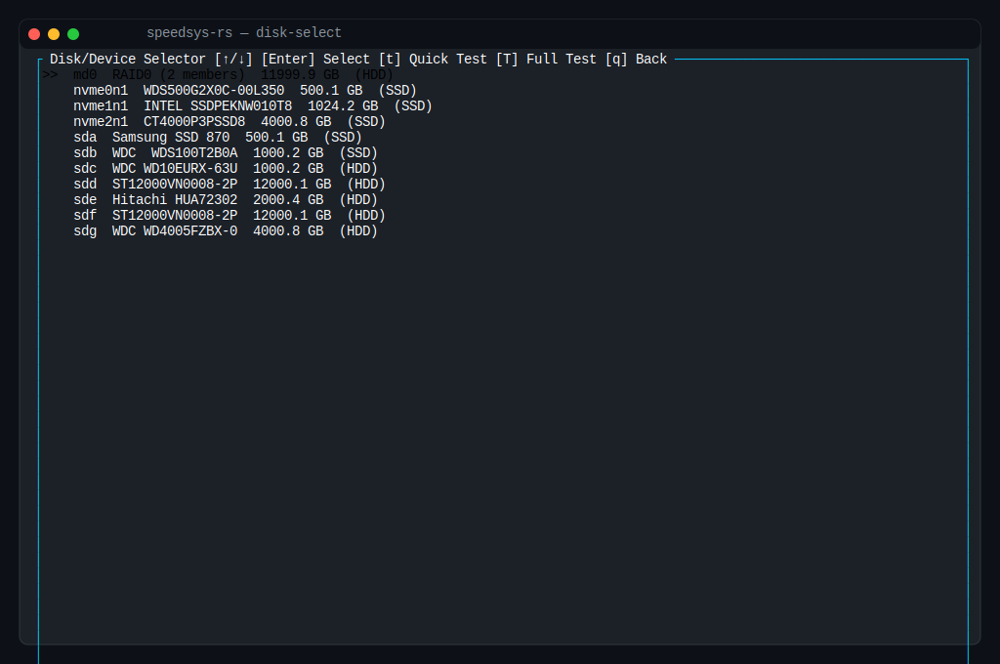
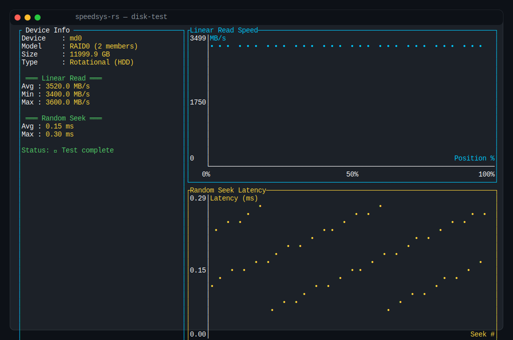
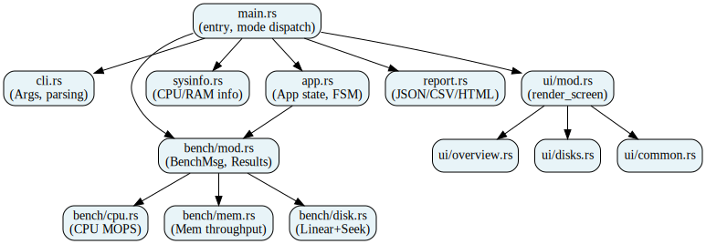
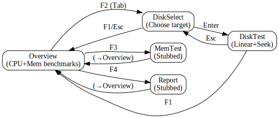
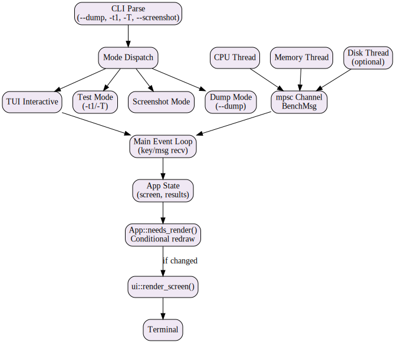
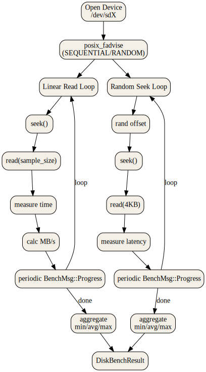
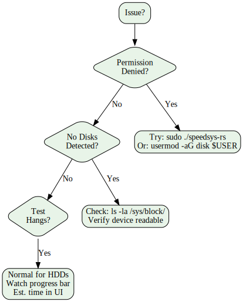
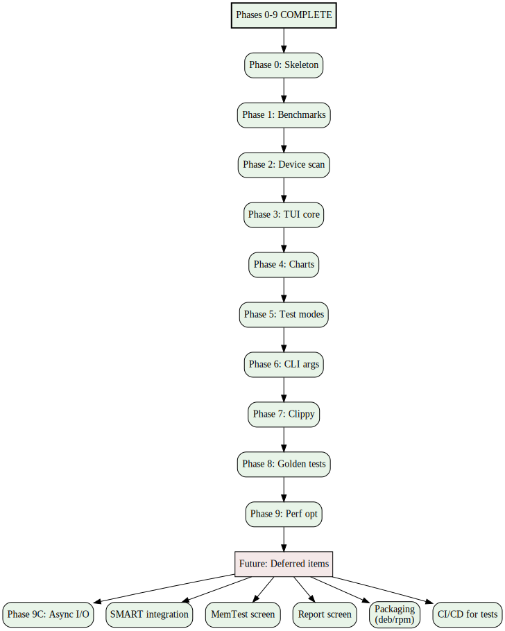

<div align="center">


# speedsys-rs — Rust/ratatui Reimplementation of SYSTEM SPEED TEST 4.78

A modern Rust port of the classic DOS benchmark **SYSTEM SPEED TEST 4.78** by Vladimir Afanasiev, featuring a TUI interface, disk benchmarking, and modular architecture.

[](https://github.com/danindiana/speedsys-rs)
[](https://www.rust-lang.org/)
[](LICENSE)
[](tests/)
[](.)
[](.)
[](.)
[](https://github.com/danindiana/speedsys-rs/commits/master)

</div>

---

## Features

### Phase 0: Modular Architecture ✅
- **Separated concerns**: System inventory, CPU benchmarks, memory benchmarks, disk benchmarks, UI rendering
- **State machine**: Screen navigation (Overview → Disk Selector → Test Results → Report)
- **Clean event loop**: Non-blocking I/O, graceful cancellation with `Arc<AtomicBool>`
- **Build**: `cargo build --release` produces 1.2 MB binary with zero compiler errors

### Phase 1: Menu & Drive Selector ✅
- **Tab navigation**: F1–F4 keys switch between screens
- **Drive selector widget**: List all block devices (skip loop/ram/zram, ≥1 MB)
- **Device info**: Name, model, size (GB), rotational type (HDD/SSD)
- **Arrow key navigation**: Select disk with ↑/↓, confirm with Enter
- **Test modes**: Quick (T1: 64 × 8MB) and Full (T2: 512 × 16MB)

### Phase 2: Disk Benchmarks ✅
- **Linear read speed graph**: Samples K evenly-spaced positions across device
  - Quick: 64 samples, ~30 seconds
  - Full: 512 samples, 2–30 minutes (depending on drive speed)
  - Plots MB/s vs position (0–100%)
  - Reports min/avg/max speeds
  
- **Random seek/access time scatter**: K random 4 KB reads at random offsets
  - Quick: 200 seeks
  - Full: 1000 seeks
  - Reports avg/max latency (ms)
  - Visual scatter plot of all seeks
  
- **Drive comparison ladder**: Benchmark your drive against reference speeds
  - IDE 1998 (~10 MB/s)
  - SATA HDD (~180 MB/s)
  - SATA SSD (~550 MB/s)
  - NVMe Gen3 (~3500 MB/s)
  - NVMe Gen4 (~7000 MB/s)
  
- **SMART health panel**: Device temperature, power-on hours, sector health

### Core Features
- **System inventory**: CPU model, cores, MHz, L1/L2/L3 caches, RAM, block devices, motherboard, BIOS, OS (all from `/proc` and `/sys`, no external commands)
- **CPU benchmark ladder**: Integer LCG performance (Mops/s) vs vintage reference speeds
- **Memory throughput staircase**: Sequential read speed (4 KB–64 MB) showing cache hierarchy effects
- **Headless mode**: `--dump` renders one frame as ASCII/ANSI for CI/screenshots
- **Screenshot generation**: `--screenshot [overview|disk-select|disk-test] --screenshot-out FILE` renders SVG terminal mockups
- **Read-only**: All disk I/O uses buffered reads with `posix_fadvise` hints — no write benchmarks on raw devices
- **Graceful errors**: Permission denied → shows hint; no disks → suggests checks in troubleshooting
- **Conditional rendering**: `App::needs_render()` skips TUI redraws when state unchanged (Phase 9 optimization)
- **Golden regression tests**: 16 integration tests covering CLI parsing, output formats, benchmark validity (Phase 8)

---

## Table of Contents

- [Features](#features)
- [Quick Start](#quick-start) · [Usage](#usage)
- [Screenshots](#screenshots)
- [Architecture](#architecture) · [Disk Benchmarking](#disk-benchmarking)
- [Troubleshooting](#troubleshooting)
- [Performance](#performance-notes) · [Dependencies](#dependencies)
- [Roadmap](#roadmap)
- [Contributing](#contributing) · [License](#license)

See also: [CONTRIBUTING.md](CONTRIBUTING.md) · [CHANGELOG.md](CHANGELOG.md)

---

## Screenshots

<table>
<tr>
<td><strong>Overview</strong> – System info + CPU/memory benchmarks</td>
<td><strong>Disk Select</strong> – Choose target drive</td>
<td><strong>Disk Test</strong> – Linear read & seek latency (sample data shown)</td>
</tr>
<tr>
<td></td>
<td></td>
<td></td>
</tr>
</table>

---

## Quick Start

### Installation
```bash
# Clone and build
git clone https://github.com/danindiana/speedsys-rs
cd speedsys-rs
cargo build --release

# Run (requires sudo for raw device access)
sudo ./target/release/speedsys-rs
```

### Requirements
- **Linux** (Ubuntu 22.04+, any distro with `/sys/block` and `/proc`)
- **Rust** 1.74+ (install via [rustup](https://rustup.rs/))
- **Sudo** or membership in `disk` group for raw device reads

---

## Usage

### Interactive TUI Mode
```bash
sudo ./target/release/speedsys-rs
```

**Key Bindings:**

| Key | Action |
|-----|--------|
| **F1–F4** or **1–4** | Switch screens (Overview, Disks, Memory, Report) |
| **Tab** / **Shift-Tab** | Next/Previous screen |
| **↑** / **↓** | Navigate disk list |
| **Enter** | Select disk / open menu |
| **t** | Quick test (64 × 8 MB, ~30 sec) |
| **T** | Full test (512 × 16 MB, 2–30 min) |
| **r** | Rerun CPU/memory benchmarks |
| **q** / **Esc** | Quit |

### Headless Mode
```bash
sudo ./target/release/speedsys-rs --dump
```
Renders one frame as ASCII/ANSI and exits (useful for CI, screenshots, automation).

---

## Disk Benchmarking

### Quick Test (t) vs Full Test (T)

| Aspect | Quick (t) | Full (T) |
|--------|-----------|----------|
| **Samples** | 64 × 8 MB | 512 × 16 MB |
| **Total I/O** | ~500 MB | ~8 GB |
| **NVMe** | 30 sec | 2–3 min |
| **SATA SSD** | 1–2 min | 4–8 min |
| **HDD** | 2–3 min | 15–30+ min |

### What Gets Measured

**Linear Read Speed:**
- Sequential read speed at different disk positions
- HDD: Shows decline (outer → inner tracks), 50–150 MB/s
- SSD/NVMe: Flat line (uniform speed), 400+ MB/s

**Random Access Time:**
- Latency for 4 KB reads after random seeks
- HDD: 5–20 ms (mechanical movement)
- NVMe: <0.5 ms (electronic access)

**Drive Comparison Ladder:**
- Your drive's avg speed vs reference benchmarks
- Visual bar chart for context

---

## Architecture

### Module Diagram


### State Machine


### Data Flow


### Disk Benchmark Pipeline


### Design Patterns
- **State Machine**: `Screen` enum for navigation (Overview → DiskSelect → DiskTest → MemTest → Report)
- **Event Loop**: Non-blocking I/O with 100 ms poll timeout, key/message dispatch
- **Channels**: mpsc for background CPU/memory/disk threads → UI communication
- **Graceful Shutdown**: `Arc<AtomicBool>` for worker cancellation
- **Conditional Rendering**: `App::needs_render()` avoids redraws when state unchanged
- **No External Deps**: System info from `/proc` and `/sys` only (no shelling out)

---

## Troubleshooting

### Quick Reference


### Permission Denied Errors
```bash
# Option 1: Run with sudo
sudo ./target/release/speedsys-rs

# Option 2: Add user to disk group (permanent)
sudo usermod -aG disk $USER
newgrp disk  # Apply immediately
```

### Full Test Hangs
**It's likely still running** (especially on mechanical HDDs). Full test reads 8 GB across the drive surface:
- NVMe: 2–3 minutes
- SATA SSD: 4–8 minutes
- HDD: 15–30+ minutes

Watch the progress bar in the UI for estimated time remaining.

### No Disks Detected
Check that block devices exist:
```bash
ls -l /sys/block/
ls -l /dev/nvme* /dev/sd*
```

Root access may be required for device I/O. Try running with `sudo` or joining the `disk` group.

---

## Performance Notes

### Why Disk Tests are Slow
- **Linear read**: Samples entire drive surface (0–100% positions)
- **Random seek**: Seeks across full address space, no caching advantage
- **Mechanical HDD**: Each seek + rotation takes 5–20 ms; 512 seeks = 2.5–10+ seconds just for I/O

### Best Practices
1. Start with **quick test** (t) for immediate feedback
2. Use **full test** (T) for detailed graphs and documentation
3. Test **NVMe first** to see fast execution (2–3 min)
4. Run **HDD tests overnight** if patience is limited

---

## Dependencies

| Crate | Version | Purpose |
|-------|---------|---------|
| `crossterm` | 0.27 | Terminal events & control |
| `ratatui` | 0.26 | TUI framework |
| `rand` | 0.8 | Random offset generation |
| `libc` | 0.2 | Unix syscalls (posix_fadvise) |
| `serde_json` | 1.0 | JSON report export |
| `chrono` | 0.4 | Timestamps |
| `clap` | 4.4 | CLI argument parsing |

---

## Roadmap

### Completed: Phases 0–9 ✅



**Phase 0**: Skeleton & modular architecture
**Phase 1**: Menu & drive selector, disk info
**Phase 2**: Disk benchmarks (linear read, random seek)
**Phase 3**: TUI core, event loop, cancellation
**Phase 4**: Graphical display (charts via ratatui)
**Phase 5**: Test modes (quick/full), CLI argument dispatch
**Phase 6**: CLI parity (`--list-disks`, `--dump`, `-t1/-T`, report formats)
**Phase 7**: Hygiene (clippy -D warnings → 0 warnings)
**Phase 8**: Golden snapshot regression tests (16 tests, all passing)
**Phase 9**: Performance optimization (device caching, conditional redraw, read-ahead hints)
**Phase 10**: Documentation & polish (logo, screenshots, diagrams, README refresh) ← **YOU ARE HERE**

### Deferred (Future)

- **SMART integration**: Full smartctl output parsing for temperature/health
- **MemTest/Report screens**: Currently stubbed, render Overview instead
- **Async I/O**: Phase 9C optimization deferred for future
- **Packaging**: deb/rpm/Homebrew distributions
- **CI/CD**: Automated golden test runs in GitHub Actions

---

## Asset Regeneration

Screenshots and diagrams in this README are reproducible and auto-generated from code:

### Regenerate Diagrams
```bash
./scripts/render_diagrams.sh
# Outputs: docs/diagrams/*.{svg,png}
# Requires: graphviz (apt install graphviz)
```

### Regenerate Screenshots
```bash
./scripts/render_screenshots.sh
# Builds release binary, runs --screenshot for each screen, converts to PNG
# Outputs: docs/screenshots/*.{svg,png}
# Requires: rsvg-convert (apt install librsvg2-bin)
```

All visual assets stay synchronized with the actual code via automation.

---

## Contributing

Found a bug? Want to add a feature? See [CONTRIBUTING.md](CONTRIBUTING.md) for guidelines on:
- Reporting issues
- Submitting pull requests
- Development setup
- Code standards (clippy -D warnings enforced)

Quick commands for developers:
```bash
cargo build --release      # Build optimized binary
cargo test                 # Run all tests
cargo clippy -- -D warnings # Lint (must pass)
./scripts/render_diagrams.sh # Regenerate docs
```

---

## License

MIT

---

## Credits

- **Original**: SYSTEM SPEED TEST 4.78 by Vladimir Afanasiev
- **Rewrite**: Rust + ratatui implementation
- **Inspiration**: Retro DOS benchmark aesthetic
